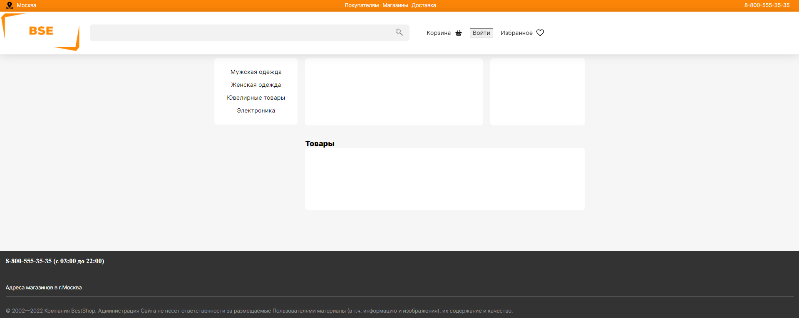
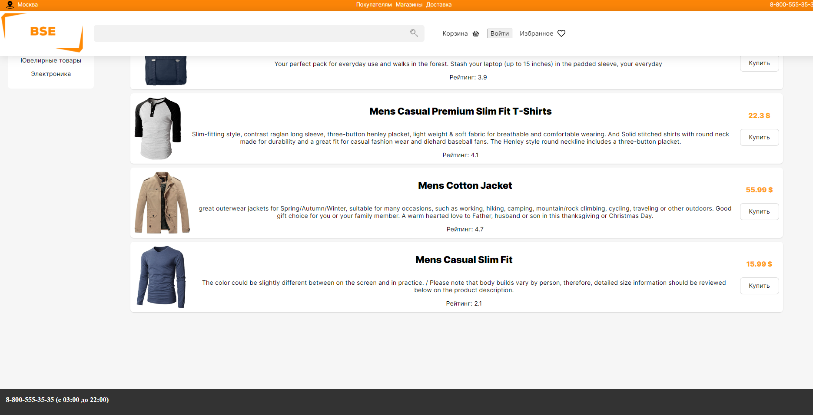
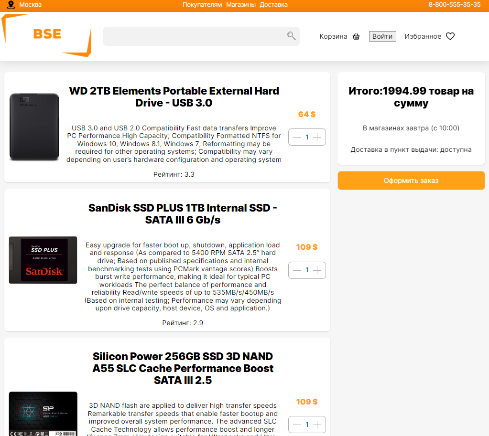

# REDUX-SHOP

## Функциональность

Сайт - магазин с различными категориями товаров.  
Запросы к api. Фильрация данных на стороне пользователя. 
Присутствует корзина, товары добавленные в корзину сохраняются 
В данном проекте использовал redux/redux-thunk 
Динамический роутинг 
аутентификация\авторизация, валидация форм 
Простенький поиск по товарам 
Loader 
Магазин еще дорабатывается, будет добавлен след. функционал: 
адаптивная верстка 
типизация данных(typescript), 
анимации кликов, инпутов и переходов 
встроенная доска задач(drag-and-drop) для работниковБ по типу trello 
плюс будет добавлено больше контента 
карта с магазинами 

### Главная страница

### Страница с товарами

### Страница с корзиной

### Стек:

- HTML
- CSS
- JavaScript
- React
- Redux/redux-thunk

### Запуск проекта

Для запуска проекта:

1. Клонировать репозиторий git clone https://github.com/Firebird234/redux-shop.git.
2. Установить все зависимости npm install.
3. Запустить проект npm start.

### Демо:

https://redux-shop-nine.vercel.app/
